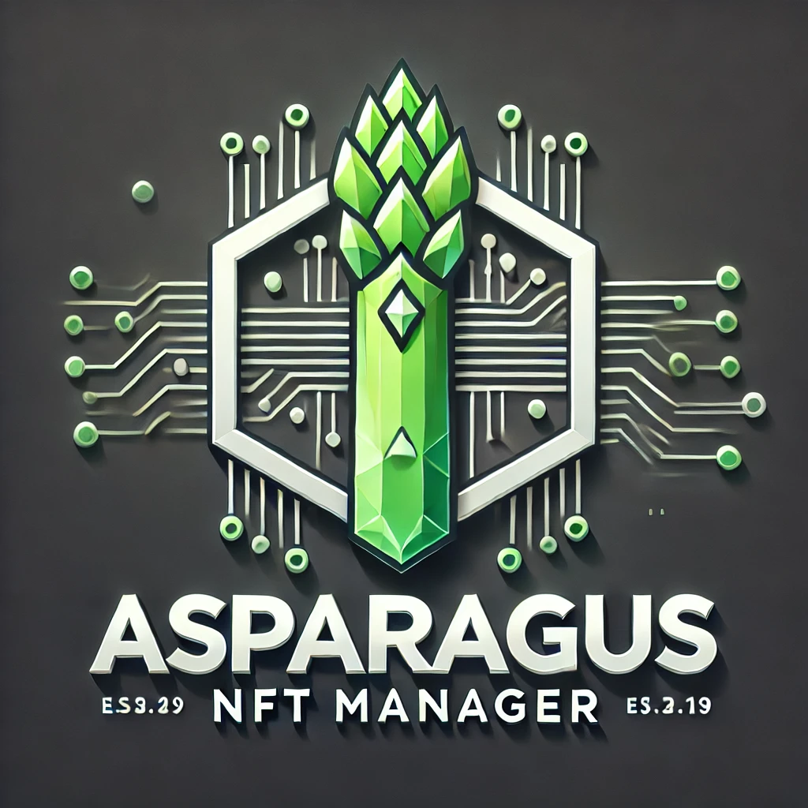

# Asparagus NF TManager


 


A multi-chain NFT management system supporting Tezos and Stargaze networks. This tool helps manage, monitor, and automate NFT sales across different blockchain platforms.

## Features

- Multi-chain support (Tezos, Stargaze)
- NFT portfolio management
- Market data analysis
- Automated listing management
- Price optimization suggestions

## Setup

1. Clone the repository:
```bash
git clone https://github.com/yourusername/asparagus-nft-manager.git
cd asparagus-nft-manager
```

2. Install dependencies:
```bash
npm install
```

3. Configure environment variables:
```bash
cp .env.example .env
# Edit .env with your configuration
```

4. Start the development server:
```bash
npm run dev
```

## Development

- `npm run build`: Build the project
- `npm run start`: Start the production server
- `npm run dev`: Start the development server
- `npm run test`: Run tests

## License

MIT License

## Contributing

Contributions are welcome! Please feel free to submit a Pull Request.